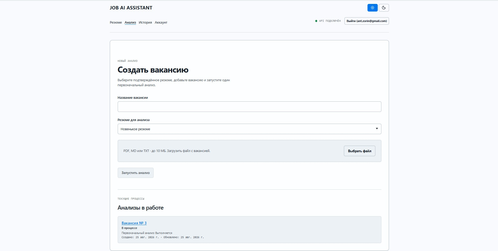
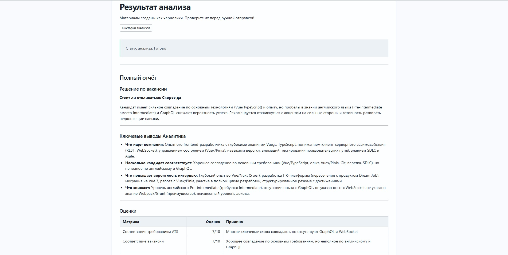

# Job AI Assistant

Русскоязычное web-приложение, которое помогает кандидату пройти путь по конкретной
вакансии: проверить соответствие опыта, подготовить материалы для отклика, разобрать
вероятные вопросы HR и осмыслить ответ после скрининга.

> **Статус:** полный portfolio-MVP реализован. Factual audit Stage 12 начинался с
> baseline [`0c43f31`](https://github.com/Zorii4/job-ai-assistant/commit/0c43f31437a71431a8aa286b62e6f78170791a64);
> portfolio-документация и quota follow-up проверены в текущей revision. Публичного
> production deployment нет. AI создаёт черновики; пользователь проверяет, копирует и
> отправляет их самостоятельно.

[English overview](#english-overview) · [Архитектура](docs/architecture.md) ·
[Спецификация](docs/product-spec.md) · [SDD case studies](docs/sdd-process.md)

## Что можно пройти сейчас

1. Зарегистрироваться по одноразовому инвайту и войти через server-side session.
2. Загрузить резюме в PDF, MD или TXT, проверить редактируемую обезличенную версию и
   подтвердить её для AI.
3. Загрузить вакансию, выбрать подтверждённое резюме и запустить initial analysis.
4. Вернуться к активному процессу после навигации или reload и получить сохранённый
   read-only Markdown-отчёт с материалами для ручного использования.
5. Вести историю вакансий со статусами «В процессе», «Отказ» и «Оффер».
6. После приглашения один раз подготовиться к HR-скринингу, а затем вставить
   обезличиваемое сообщение HR и получить краткий разбор с закрывающим сообщением.

## Инженерные акценты

| Решение | Как реализовано | Доказательство |
| --- | --- | --- |
| Проверяемый Critic | Строгий `claimAudit` фиксирует утверждение, evidence и severity; итоговое решение выводится сервером детерминированно. | [контракт](src/contracts/critic.contract.ts), [contract tests](test/contracts/critic.contract.test.ts) |
| Private prompt boundary | Workflow получает typed prompt bundle. Public mock bundle воспроизводим, real mode без private overlay завершается до LLM-вызова. | [bundle](src/ai/initialWorkflowPromptBundle.ts), [boundary tests](test/prompt-bundle-boundary.test.ts) |
| Privacy-aware async jobs | PgBoss получает только IDs. API атомарно проверяет ownership, capacity и lifetime-квоту; failed attempt освобождает unit, а manual retry резервирует её заново до `QUEUED`. | [application service](apps/api/src/applications/applications.service.ts), [quota tests](apps/api/test/applications.service.test.ts) |
| Восстановление без повторной оплаты завершённых шагов | Валидированные checkpoints позволяют worker продолжить первый незавершённый этап; несовместимый prompt/model fingerprint начинает новый согласованный flow. | [checkpoint](src/ai/initialWorkflowCheckpoint.ts), [worker tests](apps/worker/test/initial-analysis.worker.test.ts), [PR #19](https://github.com/Zorii4/job-ai-assistant/pull/19) |

## Продукт в работе

### Создание вакансии и активный анализ



### Результат initial analysis



Оба экрана сняты на синтетических данных. Hosted demo не является условием этого
portfolio-этапа: воспроизводимый mock-flow запускается локально.

## Архитектура


```text
React + Vite web
        ↓ HTTP
NestJS API ↔ PostgreSQL / Prisma
        ↓ IDs only
      PgBoss → worker → AI workflows → LLM adapter
```

Initial workflow сохраняет исходный порядок:

```text
Analyst
  → Producer
  → Critic
  → Producer revision при необходимости
  → Critic
  → Orchestrator
```

HR preparation и post-interview реализованы как отдельные одношаговые workflows. Они
не расширяют Producer и не повторяют initial analysis. Подробнее — в
[описании current/target архитектуры](docs/architecture.md).

## Privacy и контроль пользователя

- Исходный текст резюме не передаётся в LLM; AI использует подтверждённый snapshot
  обезличенной версии.
- После подтверждения рабочая запись очищается от исходного текста и имени файла;
  production backup и сроки ротации пока остаются launch gate закрытой альфы.
- Очередь получает идентификаторы, а worker загружает owner-scoped snapshots из БД.
- Пользовательские тексты, prompts, raw LLM responses, cookies и credentials не
  предназначены для логирования.
- Техническое обезличивание снижает риск, но не заявляется как юридическая гарантия.

Подробности: [privacy и security](docs/privacy-and-security.md),
[responsible disclosure](SECURITY.md).

## Быстрый запуск

Нужны Node.js, npm и Docker Compose.

```powershell
npm ci
Copy-Item .env.example .env
# Задайте уникальные POSTGRES_PASSWORD и BETTER_AUTH_SECRET длиной не менее 32 символов.
# Для воспроизводимого публичного режима оставьте LLM_MOCK=true.
docker compose up --build
```

После запуска откройте `http://localhost`. Полные инструкции для mock и private-overlay
режимов находятся в [DEPLOYMENT.md](DEPLOYMENT.md).

## Проверки

```sh
npm test
npm run build
npm run prisma:validate
npm run check:public-safety
```

Тесты по умолчанию не обращаются к реальной LLM. Для commit hook:

```sh
git config core.hooksPath .githooks
```

## Репозиторий и процесс

```text
apps/web/             React + Vite UI
apps/api/             NestJS API, auth, ownership и product rules
apps/worker/          PgBoss consumers и persistence lifecycle
packages/contracts/  shared Zod runtime contracts
src/                  AI core, application boundary и legacy adapters
prisma/               schema и воспроизводимые migrations
```

Проект развивается небольшими specification-driven итерациями. Публичные PR показывают
реальный путь от ограничений к коду и тестам: [initial web slice, PR #4](https://github.com/Zorii4/job-ai-assistant/pull/4),
[checkpoint recovery, PR #19](https://github.com/Zorii4/job-ai-assistant/pull/19) и
[сквозной review, PR #21](https://github.com/Zorii4/job-ai-assistant/pull/21).
Разбор решений и оставшихся рисков — в [SDD case studies](docs/sdd-process.md) и
[правилах agent-assisted разработки](docs/agent-development.md).

## English overview

Job AI Assistant is a Russian-language, privacy-aware workspace for a candidate working
through one job opportunity. The implemented portfolio MVP covers resume review and
confirmation, asynchronous vacancy analysis, read-only application drafts, application
history, HR-screening preparation, and a post-interview follow-up workflow.

The engineering focus is verifiable rather than promotional: strict runtime contracts,
server-side ownership, ID-only background jobs, atomic quota reservation, resumable AI
steps, a private production-prompt boundary, and deterministic mock tests. Start with
the [architecture](docs/architecture.md), [public product specification](docs/product-spec.md),
or [SDD evidence](docs/sdd-process.md). The UI and detailed documentation remain in
Russian by product decision.

## Лицензия и контакты

Исходный код доступен только для ознакомления. Проект не является open source: без
предварительного письменного согласия автора не разрешены воспроизведение,
распространение, изменение или коммерческое использование кода. Внешние contributions
на первом этапе не принимаются.

Telegram: [@Zorin_4](https://t.me/Zorin_4) · Email: [workzor@bk.ru](mailto:workzor@bk.ru)
