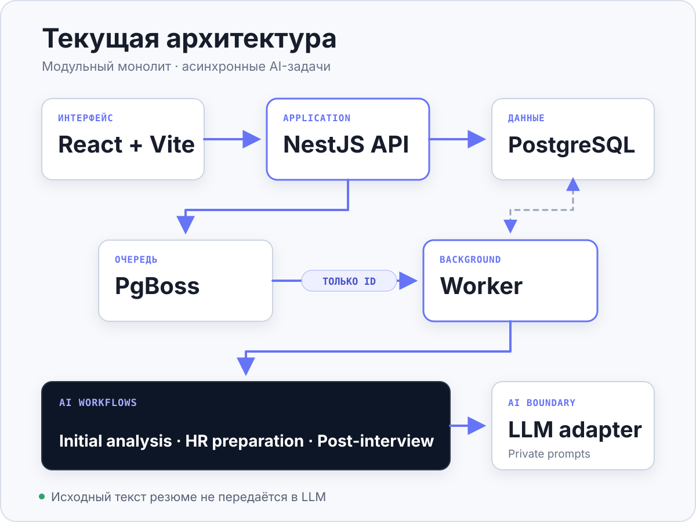

# Архитектура

## Статус документа

Baseline current architecture проверена на commit
[`0c43f31`](https://github.com/Zorii4/job-ai-assistant/commit/0c43f31437a71431a8aa286b62e6f78170791a64);
документ также включает portfolio- и quota follow-up текущей Stage 12 revision. Target
не означает реализованный production deployment.



## Current: модульный монолит

```text
Browser
  → React + Vite web
  → NestJS API
      ↔ PostgreSQL / Prisma
      → PgBoss job with IDs only
          → worker
              → application use case
              → isolated AI workflow
              → LLM adapter or deterministic mock
              → PostgreSQL result/checkpoint/artifacts

Legacy CLI / Telegram adapters
  → the same application and initial AI boundaries
  → file persistence adapter
```

### Компоненты

- `apps/web` — маршруты `Резюме`, `Анализ`, `История`, `Аккаунт` и страница результата.
  UI восстанавливается после reload, опрашивает run status и безопасно отображает
  read-only Markdown без raw HTML.
- `apps/api` — auth/session guard, owner-scoped Resume/ApplicationCase/Run/Artifact API,
  file validation, lifecycle, capacity, quota и постановка jobs.
- `apps/worker` — отдельные PgBoss consumers для initial analysis, HR preparation и
  post-interview. HTTP-сервер внутри worker отсутствует.
- `packages/contracts` — shared Zod contracts для public API и job payloads.
- `prisma` — PostgreSQL schema, constraints и воспроизводимые migrations.
- `src/app` и `src/ai` — application boundary, initial workflow и специализированные
  AI-use cases, не зависящие от NestJS, Prisma, web или Telegram.
- `src/cli` и `src/telegram` — сохранённые legacy adapters. Telegram не развивается как
  часть текущего MVP.

## Потоки данных

### Резюме

```text
PDF / MD / TXT
  → size + MIME + extension validation
  → local text extraction
  → temporary source text + editable sanitized Markdown
  → explicit user review and confirmation
  → source text and source file name cleared
  → confirmed sanitized snapshot may be used by AI
```

Public Resume contracts не возвращают source text. Upload buffer очищается после
извлечения, а имя пользовательского файла не используется как filesystem path.

### Initial analysis

```text
API transaction
  → validates session, ownership, confirmed resume, vacancy file and capacity
  → creates ApplicationCase with immutable resume/vacancy snapshots
  → creates or reuses one INITIAL_ANALYSIS run
  → atomically reserves one ALPHA unit
  → enqueues { applicationCaseId, analysisRunId }

Worker
  → atomically claims QUEUED run
  → loads snapshots from PostgreSQL
  → validates prompt/model fingerprint and existing checkpoints
  → Analyst → Producer → Critic → optional revision → Critic → Orchestrator
  → persists progress, checkpoints, finalMarkdown and idempotent Artifacts
```

Один пользователь может иметь не более двух active initial runs (`QUEUED` или
`RUNNING`). Ошибка постановки или terminal worker failure возвращает зарезервированную
единицу. Повторная доставка job не запускает второй workflow и не создаёт дубликаты
материалов.

Manual retry переиспользует failed run, но перед переходом в `QUEUED` атомарно
резервирует ранее возвращённую unit. Если пользователь уже занял освободившуюся unit и
достиг lifetime limit, retry отклоняется, а run остаётся `FAILED`. Queue failure и новый
terminal failure освобождают именно reservation текущей попытки; regressions покрывают
quota boundary, queue rollback и единственный worker release.

Успешные шаги сохраняются как runtime-валидированные checkpoints. При restart или
manual retry worker продолжает первый незавершённый шаг. Checkpoint используется только
при совпадении snapshots и fingerprint prompt/model configuration; иначе он очищается,
и flow честно начинается с Analyst.

### HR preparation

```text
confirmed resume snapshot + vacancy snapshot + successful finalMarkdown
  → one HR Preparation Generator call
  → runtime validation
  → idempotent HR_SCREENING_PREPARATION Artifact
```

Это отдельный workflow без Critic, revision и повторного initial analysis. API создаёт
один run на вакансию, очередь получает IDs, а technical failure не меняет пользовательский
status вакансии.

### Post-interview

```text
raw HR message
  → length validation and direct-identifier/signature removal
  → sanitized message persisted; raw text discarded
  → ID-only job
  → sanitized HR message + vacancy snapshot + successful finalMarkdown
  → one Post-interview Generator call
  → atomic POST_INTERVIEW_REVIEW + HR_CLOSING_MESSAGE Artifacts
```

Полный resume snapshot и HR preparation material в этот вызов не передаются. LLM не
назначает `REJECTED` или `OFFER`; outcome остаётся ручным решением пользователя.

## AI boundary

Initial, HR preparation и post-interview имеют отдельные typed prompt bundles и
runtime-контракты:

- public mock mode использует безопасные детерминированные bundles;
- real mode загружает ignored private overlay и завершается configuration error до
  LLM-вызова, если overlay отсутствует или malformed;
- production prompt text не импортируется tracked agent-модулями напрямую, не
  передаётся frontend и не включается в диагностические ошибки;
- structured responses проходят strict JSON Schema у совместимого route и повторную
  Zod-валидацию после ответа;
- Critic возвращает findings и `claimAudit`, а итоговые `decision` и `reviewStatus`
  вычисляются сервером из severity, чтобы terminal state не противоречил findings.

## Persistence и идемпотентность

- `AnalysisRun` уникален по паре `applicationCaseId + workflowType`.
- `Artifact` уникален по `applicationCaseId + type`.
- Atomic claim отделяет `QUEUED` от `RUNNING` и не допускает параллельный duplicate run.
- Очередь хранит identifiers; пользовательские тексты загружаются только worker-ом.
- Для каждого failed workflow разрешено не более трёх server-enforced manual retry.
- Retry initial workflow использует совместимый checkpoint; одношаговые workflows
  повторяют только свой вызов и не расходуют новую product unit.
- `generatedContent` и legacy-поля пользовательской редакции остаются раздельными.
  Текущий web UI новые редакции не создаёт и показывает результат read-only.

## Ownership и trust boundaries

```text
Browser request
  → server-side session
  → runtime validation
  → query scoped by userId or equivalent relation
  → owned record only
```

Скрытый UI control не считается авторизацией. Public API не возвращает provider tokens,
auth internals или source resume text. Tests покрывают невозможность прочитать, изменить,
запустить workflow или удалить сущность другого пользователя.

## Target: инфраструктура закрытой альфы

Следующая архитектурная граница относится к эксплуатации, а не к новому product flow:

- российская VPS и TLS reverse proxy;
- production secret storage и безопасная доставка private prompts только worker-у;
- отдельный зашифрованный backup PostgreSQL с проверенным restore;
- monitoring диска, health и обезличенных ошибок;
- документально проверенный LLM-route и privacy/legal review;
- production-проверка cookie `Secure`/SameSite, CSRF и rate limits на фактическом
  deployment.

Возможный перенос общих use cases из legacy `src/` в `packages/application` и
`packages/ai` остаётся target-рефакторингом. Пустые пакеты заранее не создаются.

## Архитектурные инварианты

- Один пользователь не получает доступ к сущности другого пользователя.
- Source resume text не попадает в LLM.
- Job payload не содержит полные пользовательские тексты.
- AI создаёт материалы, но не выполняет внешние действия.
- Initial workflow сохраняет порядок агентов и ограниченное число revision.
- Специализированные workflows не расширяют Producer неявно.
- Public code не включает production prompts, credentials или evaluation corpus.

## Как поддерживать документ

Документ обновляется в той же задаче при изменении current components, data flow,
ownership, persistence, retry/quota semantics или target deployment boundary. Все
утверждения о реализации должны проверяться кодом и тестами выбранного anchor commit.
